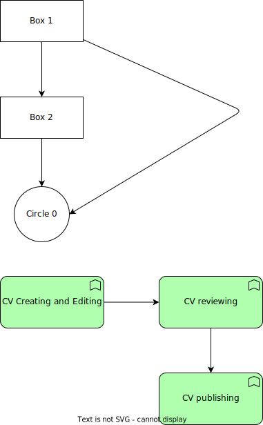

# Preview a diagram

## Diagram

That was pretty easy.

## Font

I quite like the [Architects Daughter](https://fonts.google.com/specimen/Architects+Daughter) font by [Kimberly Geswein](https://fonts.google.com/?query=Kimberly+Geswein) that is available in [Draw.io](https://app.diagrams.net/).

## Other stuff

This is normal text typed into a paragraph.
A new line **doesn't** mean it will be presented that way in the target.
