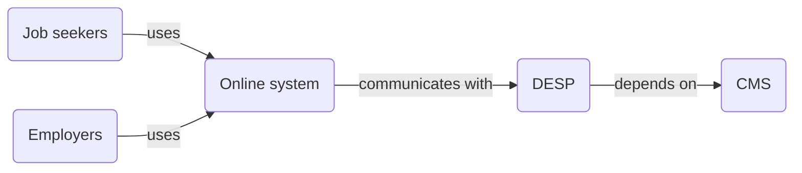
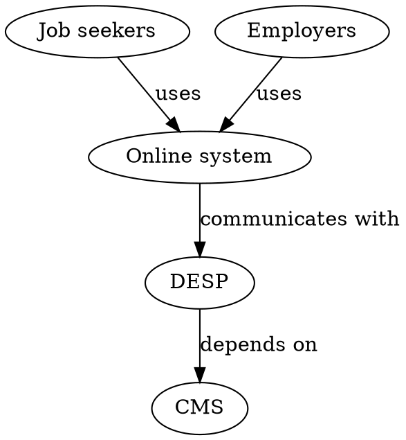
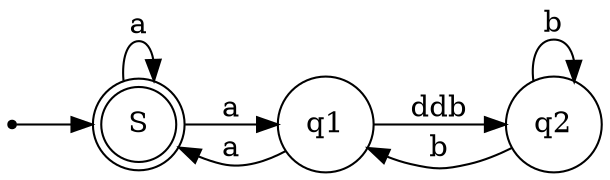

# DESP

## Mermaid diagram

### Sequence



## Graphwiz diagram

It is not actually `graphwiz`, should be `graphviz`.

See the [Graphviz](https://graphviz.org/) website.

```graphwiz
digraph G {
    Job_seekers [label="Job seekers"]
    Online_system [label="Online system"]
    DESP [label="DESP"]
    CMS [label="CMS"]
    Employers [label="Employers"]

    Job_seekers -> Online_system [label="uses"]
    Online_system -> DESP [label="communicates with"]
    DESP -> CMS [label="depends on"]
    Employers -> Online_system [label="uses"]
}
```



Bing says the `dot` is the same as `graphviz`.


## From the extension example

The `graphviz` examples render on first preview but the rendering disappears once a change is made. A refresh of the preview also works.


