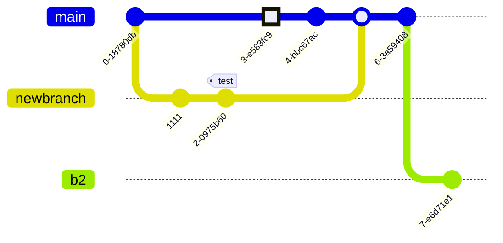

# My mermaid adventure

## Mermaid diagram

[Diagram types](https://mermaid.js.org/intro/#diagram-types)

### Sequence


### Flowchart

:::mermaid
graph TD;
    A-->B;
    A-->C;
    B-->D;
    C-->D;
:::

### Flowchart 2


### Gantt diagram


### Mindmap


### Git commits



## Graphviz diagram

```graphwiz
graph graphname {
    a -- b -- c;
    b -- d;
}
```


