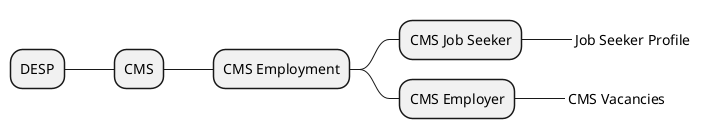
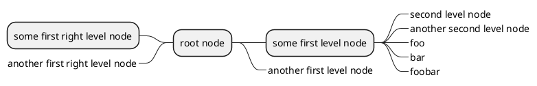

# Mindmap in PlantUML

```plantuml
@startmindmap
* DESP
** CMS
*** CMS Employment
**** CMS Job Seeker
*****_ Job Seeker Profile
**** CMS Employer
*****_ CMS Vacancies
@endmindmap
```

```plantuml
@startmindmap
+ root node
++ some first level node
+++_ second level node
+++_ another second level node
+++_ foo
+++_ bar
+++_ foobar
++_ another first level node
-- some first right level node
--_ another first right level node
@endmindmap
```
