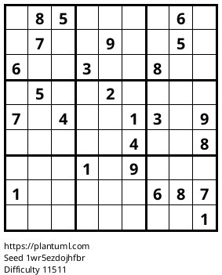

# Render PlantUML inline inside a Markdown file

## Guide to PlatnUML

[The Hitchhiker’s Guide to PlantUML!](https://crashedmind.github.io/PlantUMLHitchhikersGuide/index.html)

## Sequence diagram

A PlantUML diagram:


## uml: sequence diagram

Here I will embed PlantUML markup to generate a sequence diagram.

I can include as many plantuml segments as I want in my Markdown, and the diagrams can be of any type supported by PlantUML.


## Component diagram

[Component Diagram](https://plantuml.com/component-diagram)


## Grouping components

From ??


## Sudoku



## Flowchart

A flow chart?

This form of `mermaid` diagram doesn't work with `plantuml`.

```plantuml
@startuml

flowchart TB
    c1-->a2
    subgraph ide1 [one]
    a1-->a2
    end
@enduml
```

It should look like:


A `digraph` attempt at the same diagram:


The following was generated with the help of ChatGPT.


Bing helped create this component diagram:


## Digraph


## Another digraph


## Archimate

In theory the following `div` generates a hidden diagram. Then the later image inclusion displays it.

An alternative [suggestion](https://gist.github.com/noamtamim/f11982b28602bd7e604c233fbe9d910f) is to surround the uml wiht `<!--    -->`.

See [](https://gist.githubusercontent.com/noamtamim/f11982b28602bd7e604c233fbe9d910f/raw/a30512d25ae52b61e9c1e904f9713488288fd910/sample.md)

<div hidden>


</div>

## Display diagram

In theory, the diagram will display here:


## Big archimate example


### List Archimate stuff


### Relationship types


